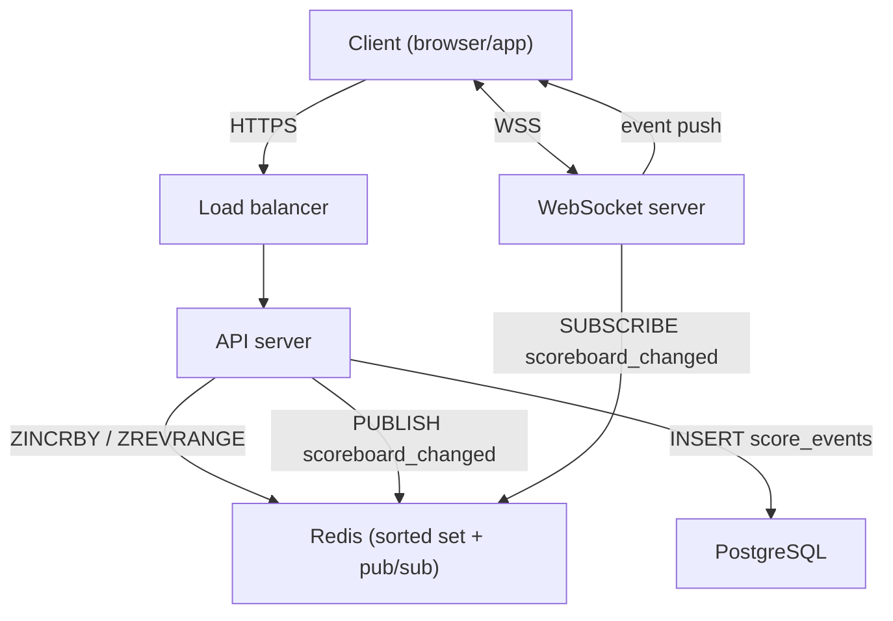

# Scoreboard Module - Specification

## Overview

This module powers a live top-10 scoreboard. Users earn points by
completing actions in the application; the score for each user is
updated server-side when the action is reported, and all connected
clients see the new top-10 in near real time.

**In scope:**

- Receiving and validating score-earning action submissions.
- Maintaining a ranked leaderboard.
- Serving the current top-10 on demand and pushing changes to
  connected clients.
- Preventing the most common forms of score tampering.

**Out of scope:**

- The action implementation itself (we only record the points it
  earned).
- User registration, authentication issuance (handled by an upstream
  auth service - we only consume its JWTs).
- Admin tooling, account recovery, score appeals.

## Architecture

| Component       | Technology              | Role                                                |
|-----------------|-------------------------|-----------------------------------------------------|
| API Server      | Node.js + Express       | REST endpoints, JWT validation, action processing   |
| WebSocket Server| `ws` library            | Pushes scoreboard updates to connected clients      |
| Database        | PostgreSQL              | Durable audit log of every score event              |
| Cache & Ranking | Redis                   | Sorted set for the live leaderboard, pub/sub fan-out|

The API server and the WebSocket server can live in the same process
during early stages and split out later without changing the contract.



## Data Model

### PostgreSQL

```sql
CREATE TABLE users (
    id          UUID PRIMARY KEY DEFAULT gen_random_uuid(),
    username    VARCHAR(50) UNIQUE NOT NULL,
    created_at  TIMESTAMPTZ DEFAULT now()
);

CREATE TABLE score_events (
    id              UUID PRIMARY KEY DEFAULT gen_random_uuid(),
    user_id         UUID NOT NULL REFERENCES users(id),
    action_type     VARCHAR(50) NOT NULL,
    points          INTEGER NOT NULL,
    idempotency_key VARCHAR(100) NOT NULL,
    created_at      TIMESTAMPTZ DEFAULT now(),
    CONSTRAINT score_events_user_idempotency UNIQUE (user_id, idempotency_key)
);

CREATE INDEX idx_score_events_user ON score_events(user_id);
CREATE INDEX idx_score_events_created ON score_events(created_at);
```

`score_events` is append-only. The `(user_id, idempotency_key)`
unique constraint prevents the same submission from being processed
twice. The database does not store a running total - that lives in
Redis and can be rebuilt from this table at any time.

### Redis

```
KEY:   leaderboard            (Sorted Set)
MEMBER: user:<user_id>
SCORE:  cumulative score
```

- `ZINCRBY leaderboard <points> user:<id>` - O(log N) update
- `ZREVRANGE leaderboard 0 9 WITHSCORES` - O(log N + 10) top-K read

Sorted sets are far cheaper than `ORDER BY score DESC LIMIT 10` on a
relational table under sustained write load.

A second Redis hash `user_profiles` caches `username`/avatar lookups
with a 5-minute TTL so the leaderboard endpoint never has to hit
PostgreSQL on a read.

## API Design

All endpoints require a valid JWT in `Authorization: Bearer <token>`.
The user id is taken from the JWT, never from the request body.

### Submit a score action

```
POST /api/scores/actions
```

Request:

```json
{
  "actionType": "complete_quiz",
  "idempotencyKey": "complete_quiz_42_1713264000"
}
```

| Field            | Type   | Required | Description                                         |
|------------------|--------|----------|-----------------------------------------------------|
| `actionType`     | string | yes      | Server-known action identifier                      |
| `idempotencyKey` | string | yes      | Client-supplied unique key per submission per user  |

Response (200):

```json
{
  "actionType": "complete_quiz",
  "pointsAwarded": 10,
  "newTotalScore": 150
}
```

Response (409 - duplicate submission):

```json
{
  "error": {
    "code": "DUPLICATE_REQUEST",
    "message": "Action already processed for this idempotency key"
  }
}
```

The client never sends a numeric score. The server resolves
`actionType` against a small server-side mapping:

```ts
const ACTION_POINTS: Record<string, number> = {
  complete_quiz: 10,
  daily_login: 5,
  refer_friend: 20,
};
```

### Get the leaderboard

```
GET /api/leaderboard
```

Response (200):

```json
{
  "leaderboard": [
    { "rank": 1, "userId": "a1b2c3", "username": "alice", "score": 500 },
    { "rank": 2, "userId": "d4e5f6", "username": "bob",   "score": 480 }
  ],
  "updatedAt": "2026-04-16T12:00:00Z"
}
```

Served from Redis. Sub-millisecond on the hot path.

### Error response shape

All errors follow the same shape:

```json
{
  "error": {
    "code": "ERROR_CODE",
    "message": "Human-readable description"
  }
}
```

| Code                | HTTP | Description                                      |
|---------------------|------|--------------------------------------------------|
| `UNAUTHORIZED`      | 401  | Missing, invalid, or expired token               |
| `INVALID_ACTION`    | 400  | `actionType` not in the allowed list             |
| `DUPLICATE_REQUEST` | 409  | Idempotency key already processed for this user  |
| `RATE_LIMITED`      | 429  | Too many submissions                             |
| `VALIDATION_ERROR`  | 400  | Malformed body                                   |
| `INTERNAL_ERROR`    | 500  | Unexpected server error                          |

## Real-time Update Design

### Transport choice

WebSocket over SSE. Reasons:

- Bidirectional channel lets us add ping/pong heartbeats and future
  client-initiated subscriptions (e.g. user-specific notifications)
  without adding another transport.
- Mature server-side ecosystem (`ws`, Socket.IO).
- SSE has no built-in heartbeat and is constrained by the browser's
  per-host connection limit.

### Connection contract

```
wss://<host>/ws/leaderboard?token=<jwt>
```

The JWT is verified during the upgrade handshake. Invalid tokens get
HTTP `401` and the connection is rejected. (Passing tokens via query
string is acceptable for an internal demo; production should prefer a
short-lived WebSocket-only token or header-based auth if the
infrastructure supports it.)

### Server-to-client events

`leaderboard:initial` - sent immediately after a successful upgrade.
The client gets the current top-10 without needing a separate REST
call.

```json
{
  "event": "leaderboard:initial",
  "data": {
    "leaderboard": [ ... ],
    "updatedAt": "2026-04-16T12:00:00Z"
  }
}
```

`leaderboard:update` - sent whenever the top-10 actually changes
(after debouncing).

```json
{
  "event": "leaderboard:update",
  "data": {
    "leaderboard": [ ... ],
    "updatedAt": "2026-04-16T12:00:05Z"
  }
}
```

`error` - sent when a server-side condition affects the connection
(e.g. token expired). Client should reconnect with a fresh token.

### Top-10 change detection

Many score updates do not move anyone into or out of the top 10. We
avoid broadcasting in those cases:

1. Read the current top-10 from Redis before the increment.
2. Apply `ZINCRBY` (server is single-writer per user thanks to
   idempotency, so no `WATCH/MULTI` is needed for correctness).
3. Read the new top-10 from Redis.
4. If the snapshots differ, publish to the `scoreboard_changed`
   pub/sub channel.

A small JSON-stringify comparison is sufficient for 10 entries; a
hash would be marginally cheaper but not worth the readability cost.

### Debouncing

The WebSocket layer batches outgoing messages within a 200 ms window.
If multiple `scoreboard_changed` notifications arrive in that window
only the latest snapshot is delivered. This protects clients from
render thrashing under sudden bursts.

### Reconnection

| Scenario                  | Client behaviour                                     |
|---------------------------|------------------------------------------------------|
| Network drop              | Reconnect with exponential backoff: 1s → 2s → 4s, capped at 30s |
| `error: TOKEN_EXPIRED`    | Stop, refresh token, then reconnect                  |
| 401 on handshake          | Do not retry - token is invalid                      |
| Successful reconnect      | Receive `leaderboard:initial` snapshot - no merging  |

Because every payload is a full snapshot, reconnection has no state
to reconcile.

### End-to-end flow

See [Diagram.md](Diagram.md) for the full sequence diagram covering
JWT verification, rate limiting, idempotency, score update, snapshot
comparison, and the conditional broadcast path.

## Flow of Execution

1. The user completes an action in the client (e.g. finishes a quiz).
2. The client `POST`s `/api/scores/actions` with the `actionType`,
   the `idempotencyKey`, and the JWT.
3. The API server verifies the JWT, extracts the user id, and checks
   that `actionType` is in the allow-list.
4. The server attempts to insert into `score_events`. If the unique
   constraint fires, the request is treated as a replay and the prior
   result is returned (409).
5. The server resolves `actionType` to a point value, snapshots the
   current top-10, and runs `ZINCRBY` on Redis.
6. The server snapshots the new top-10. If it differs from the
   pre-snapshot, it publishes `scoreboard_changed` on Redis pub/sub.
7. Every WebSocket server subscribed to that channel pushes
   `leaderboard:update` to its connected clients (after the 200 ms
   debounce window).
8. Each client renders the new leaderboard.

## Security

- **Authentication.** All HTTP and WebSocket endpoints require a JWT
  issued by the upstream auth service. The user id comes from the
  token's `sub` claim - never from the request body.
- **Action-based API, not score-based.** The client tells the server
  *what happened*, not *how many points it is worth*. The mapping
  lives server-side. This eliminates the simplest form of cheating
  (sending an arbitrarily large number).
- **Server-side action validation.** Beyond the simple allow-list,
  high-value actions (e.g. `complete_quiz`) should be backed by a
  server-side check that the action actually completed - storing only
  a "done" flag on the client is not enough. This is documented as a
  future improvement (see below).
- **Idempotency.** The `(user_id, idempotency_key)` uniqueness
  constraint prevents naive replay attacks. Returning a deterministic
  409 also gives the client a clear retry contract.
- **Rate limiting.** Per-user limit (e.g. 10 submissions per minute)
  using a Redis sliding-window counter keyed by `rl:score:<user_id>`.
  Exceeded → `429 RATE_LIMITED`.
- **Input validation.** Reject unknown fields and oversized payloads
  at the edge.

## Consistency Model

The system is dual-write: the durable record (PostgreSQL) and the
serving cache (Redis) are updated in sequence within the request
lifecycle.

- PostgreSQL is the **source of truth**. Redis can always be rebuilt
  from `score_events` with `SELECT user_id, SUM(points) ... GROUP BY
  user_id`.
- Order: insert into PostgreSQL first, then `ZINCRBY` Redis. If the
  PostgreSQL write fails the request fails - we never increment Redis
  for an event that is not durably recorded.
- If the Redis write fails after a successful PostgreSQL insert, the
  request returns a 5xx, the event is in the audit log, and a
  background reconciliation job re-applies the increment. The
  user-visible side is "the score didn't update for ~30s" rather than
  "your score is permanently lost".
- Timeouts are tight (50-100 ms for Redis, 200-300 ms for PostgreSQL)
  with at most 2-3 retries on transient network errors.

## Observability

- **Structured logs** with a `requestId` propagated from the inbound
  HTTP request through any background fan-out. Each log entry
  includes `userId`, `actionType`, `points`, and outcome.
- **Metrics.** RPS and error rate per endpoint, Redis and PostgreSQL
  latency histograms, leaderboard update count, active WebSocket
  connections, broadcast skip rate (pub/sub messages that did *not*
  result in a top-10 change).
- **Alerts.** 5xx rate above threshold, Redis or PostgreSQL down,
  abnormal spike in score submissions per user (potential abuse),
  drop in WebSocket connection count.
- Tracing (OpenTelemetry) is optional but cheap to add; useful for
  spotting where a slow response is spending its time.

## Scalability and Trade-offs

| Decision                          | Chosen                              | Alternative                  | Reasoning                                                                  |
|-----------------------------------|-------------------------------------|------------------------------|----------------------------------------------------------------------------|
| Ranking engine                    | Redis sorted set                    | PostgreSQL `ORDER BY`        | O(log N) updates and reads vs sequential scan under contention             |
| Real-time transport               | WebSocket                           | SSE                          | Bidirectional, built-in ping/pong, no per-host connection limit            |
| Score API shape                   | Action-based (server resolves pts)  | Score-based (client sends N) | Forecloses the "send 999999 points" attack vector                          |
| Persistence                       | PostgreSQL + Redis                  | Redis only                   | Redis loss is recoverable from the audit log; pure Redis is not durable    |
| Top-10 change detection           | Snapshot diff before broadcasting   | Always broadcast on increment | Avoids fan-out for the common case where the top 10 did not change         |
| Broadcast pacing                  | 200 ms debounce window              | Per-event broadcast          | Trivial UX delay, large reduction in render thrashing under load           |

Stateless API and WebSocket processes scale horizontally behind a
load balancer. Redis pub/sub keeps cross-instance fan-out coherent.
For multi-region deployments the cleanest path is regional
leaderboards with a separate aggregation job for a global view.

## Future Improvements

- **Stronger action verification.** Today the server trusts that the
  client actually performed the action it claims. For high-value
  actions, require a server-issued "action completion token" or move
  the verification into a dedicated `action-service`.
- **Cooldowns.** Minimum interval between consecutive submissions of
  the same `actionType` per user, enforced via Redis.
- **Anomaly detection.** Flag users whose submission rate is several
  standard deviations above the cohort mean for review.
- **Batched score events.** At very high write volume, buffer
  `score_events` inserts in a queue (e.g. Kafka or BullMQ) and write
  in micro-batches. Redis updates can stay synchronous.
- **`GET /api/leaderboard/me`.** Return the caller's rank and score
  via `ZREVRANK` - useful for "you're #137" UI.
- **Seasonal leaderboards.** Periodic resets with the previous
  leaderboard archived to PostgreSQL.
- **Username/profile cache invalidation.** Today we rely on the
  5-minute TTL; a small invalidation hook on profile edit would make
  changes visible immediately.
- **Open question.** Should ties be broken by earliest arrival time
  or by submission count? The current implementation falls through to
  Redis's lexicographic order on the member key, which is
  deterministic but not meaningful. Worth deciding before launch.
